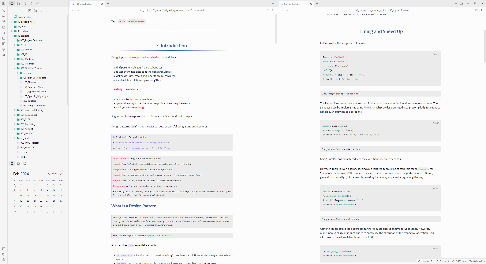
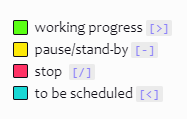

# Readme

`Sparkling Day` is the light theme derived from <a href="https://github.com/isax785/obsidian-sparkling-night">Sparkling Night</a>.

## Sparkling Checkboxes

Sparkling colored checkboxes can be used to apply a distinction to the tasks (e.g. noticing the state of the task as shown below):

Syntax:

| Checkbox | Description |
|---|---|
|`- [>]` | working progress|
|`- [-]` | pause/stand-by|
|`- [/]` | stop |
|`- [<]` | to be scheduled |

# Installation

To install the theme

- Open Obsidian Settings
- Go to `Appearance` and click `Manage`
- Under community themes search for "Sparling Night" and click `Use`

Enjoy!✨
